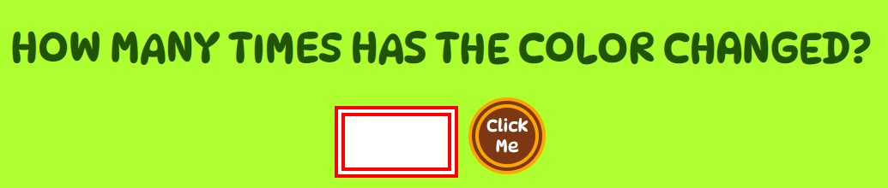

# RAINDOM
Raindom is a fully responsive JavaScript memory and concentration game. It is a ten level game, with increasing difficulty as progressing of level. 
The main rule is very simple :
the central square on the page, which is where the game is performing, will change color several times.
The user will have to say how many times the color of the central square has changed.
The goal of this game is to entertain the user. Altough is a simple game made on a simple principle, as the level increases, it will add some challenges to mantain high  user's concentration and to make the game more intriguing and funny.
<inserire screen shot>
## Features
### The  Game Screen
 - Featured in the center of the page, the Game Screen is the main component of the page, as it is within it that the game will be displayed.
 In this section the user will be able to see the title of the game, the instructions that explain the user how the game works and a button that will allow the user to start the game when clicked.
   
 

 ### The Game
  - Once the Start button is clicked all the features of the game screen will be removed and replaced by the game itself, consisting of ten levels, where level 1 is the easiest level and level ten the most complicated.
  - Every level includes a  series of colors that randomly alternate on the screen.
  - Every color is matched by a word that represents the color displayed on the screen to allow every user to understand which color is performing and give every user the accessibility to the game.
  
  
  

### The Game Question and Answer
- When the level is over a question combined with an answer field and a button to answer the question, is displayed under the game screen.
- The purpose of the question is to highlight the main goal of the game: it asks the user how many times the color has changed.
- The purpose of the answer field and the button is to let the user interact with the game .

### The Score Area
- The Score Area consist of 3 values and is connected to the interaction of the user with the question and the answer button:
  - it's right :(number) value :It represents the correct answers given by the user. Its value will increase for every correct answer.
  - it's wrong :(number) value :It represents the incorrect answers given by the user. It's value will increase for every incorrect answer.
  - Attempts:(number)value : It represents the possibilities the user has to give the incorrect answer. The total number of the attempts are 3 and this value will decrease for every incorrect answer given by the user.
  When the user gives an incorrect for a specific level, the level the user  has failed will repeat, untill when the number of the attempts will reach the value of "0" and the user will have to start the game from Level 1.
  - The purpose of the score area is for the user to keep track of his/her scores and to be able to know how many chances to fail he/she has before starting the game all over.

### Increase Level
If the user is able to give 4 correct answers the difficulty of the game will be increased.
- The game screen will be replaced by new instructins, to let the user understand the  task for the  new challenge .
The purpose of increasing the game level is to maintain the attention and curiosity of the user and to make the game funnier.
- Under the game screen with the instructions for the new challange then, a new question and a "Go" button will be displayed.
The purpose of this section is to give the user the time to understand the new challange and decide when to start the new level.

 
 ### End of the Game
 The purpose of this section is to let the user know he/she has successfully passed all the ten levels and gives the user the chance to play again.
 - If the user is able to reach 10 correct answers after passing the ten levels, the game screen will be replace by a new screen which will establish the end of the game.
 - A new Game button will be displayed and if clicked the game will start from level one.

 

 ## Validator Testing
- HTML
    - No errors were returned when passing through the official W3C validator. 
- CSS
    - No errors were found when passing through the official Jigsaw validator. 
- JavaScript
    - No errors were found when passing through the official Jshint validator. 
      - The following metrics were returned: 
      
Metrics
- There are 39 functions in this file.

Function with the largest signature take 0 arguments, while the median is 0.

Largest function has 25 statements in it, while the median is 9.

The most complex function has a cyclomatic complexity value of 4 while the median is 2.

Three unused variables
- 71	clearAnswer
- 7	emptyBoxGame
- 810	startNewGame

 

